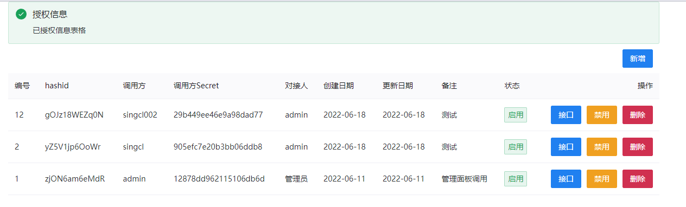
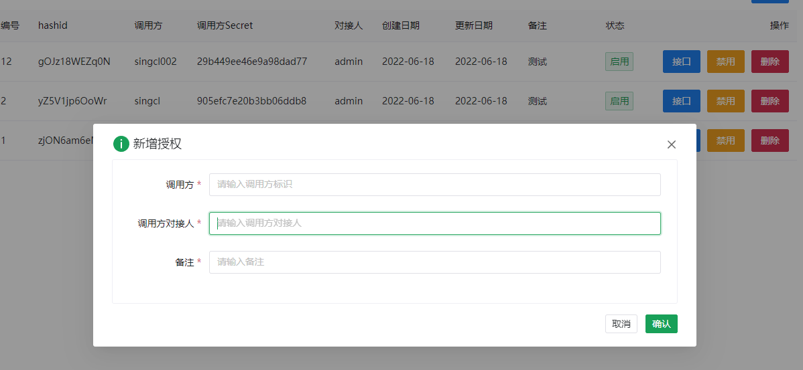
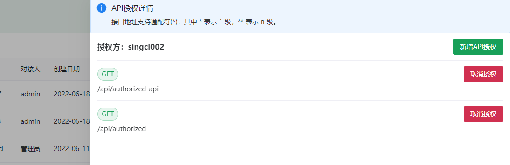

# GIN-TARO-API

Inspired by [go-gin-api](https://github.com/xinliangnote/go-gin-api). about some other resource [gin framework](https://gin-gonic.com/zh-cn/docs/quickstart/)
,[moose-go](https://gitee.com/shizidada/moose-go)

## start

go run github.com/singcl/gin-taro-api -env pro

## mysql

```sql
-- root 用户登录
sudo mysql
-- 创建数据库
CREATE DATABASE gin_taro_api DEFAULT CHARACTER SET = 'utf8mb4';
/* 为远程用户授权 */
GRANT ALL PRIVILEGES ON gin_taro_api.* TO taro'@'127.0.0.1' WITH GRANT OPTION;
```

## Mail

告警邮件发送调试通过 SUCCESS😇

## Debug

在 vscode 中调试应用程序

相关参考文档

```sh
  # https://github.com/golang/vscode-go/blob/master/docs/debugging.md
  # https://code.visualstudio.com/docs/languages/go#_debugging
  # https://juejin.cn/post/6844904087763304462
```

1. 手动安装`delve` Go debugger

```sh
# Install the latest release:
$ go install github.com/go-delve/delve/cmd/dlv@latest

```

2. 配置 launch.json

```js
// Use IntelliSense to learn about possible attributes.
// Hover to view descriptions of existing attributes.
// For more information, visit: https://go.microsoft.com/fwlink/?linkid=830387
// https://github.com/golang/vscode-go/blob/master/docs/debugging.md
// https://code.visualstudio.com/docs/languages/go#_debugging
// https://juejin.cn/post/6844904087763304462
```

```json
{
  "version": "0.2.0",
  "configurations": [
    {
      "name": "Launch Package",
      "type": "go",
      "request": "launch",
      "mode": "auto",
      "program": "${workspaceFolder}"
    }
  ]
}
```

## 界面




